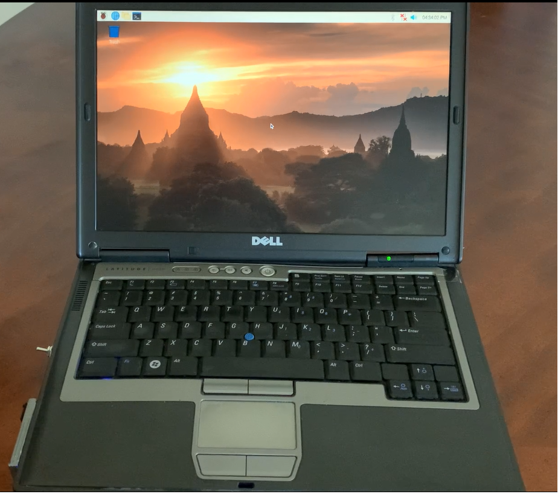
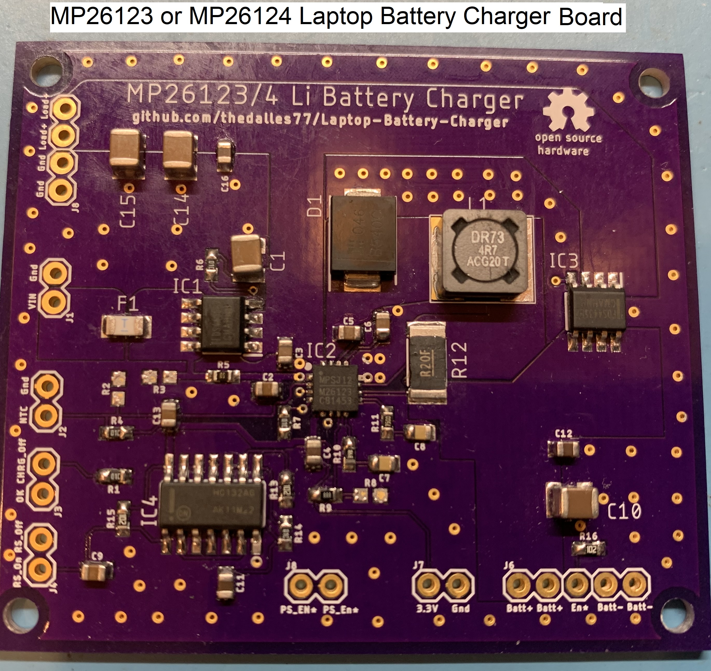

# Laptop-Battery-Charger
This repository has all the files that I used to repurpose a Dell D630 laptop into a portable Raspberry Pi. 

The Instructable "Battery Powered Raspberry Pi in Repurposed Laptop" is at this url:

https://www.instructables.com/Battery-Powered-Raspberry-Pi-in-Repurposed-Laptop/

The Video "Portable Raspberry Pi Laptop with a Custom Battery Charger" is at this url:

https://vimeo.com/504006511

The Max1873 based battery charge controller board shown below is detailed as a 
Hackster.IO project at this url:

https://www.hackster.io/frank-adams/laptop-battery-charge-controller-e9c3dc

The MP26123 based battery charge controller board shown below is detailed as a 
Hackaday.IO project at this url:

https://hackaday.io/project/177700/details/

A battery fuel gauge using Cairo can be found at this location: 
https://github.com/thedalles77/Raspberry-Pi-easy-drawing

The folders at this repo are organized as follows:

  AT Tiny Supervisor folder contains the AT Tiny 85 code to supervise the charging of a 3 series or 4 series wired battery pack.
  
  Eagle_Board_Files folder contains two folders: One for the Max1873 board and one for the MP26123_4 board. They contain the Eagle layout and schematic, parts list, and test procedure.
  
  Dell_D630_Portable_Pi_KVM folder contains the keyboard matrix and Teensy 3.2 Arduino code for controlling the keyboard, touchpad, and video converter card.
  
  My_Ugly_C_Code folder contains the Pi C code that reads the battery status registers over the SMBus.
  
  USB_SMBUS_CP2112 folder contains the Eagle board files to build a USB to SM Bus bridge for reading the battery status registers. See https://github.com/thedalles77/cp2112_demo for the code to display the battery status registers.
  
  Load_Switch_NCP_45760 folder contains the Eagle board files to build a load switch using the On Semiconductor NCP45760 chip.
